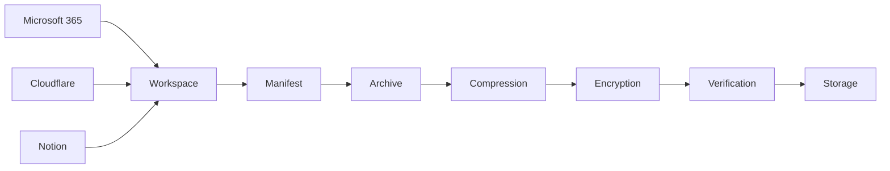
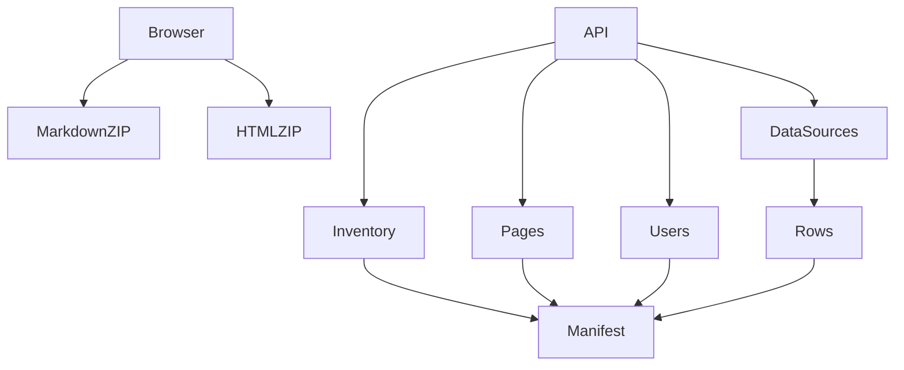

# HonestBackup

> **Compliance-first Backup Framework for Microsoft 365, Cloudflare and Notion**


---

# Overview

HonestBackup is a compliance-focused backup framework designed to preserve organizational configuration, metadata, audit evidence, and documentation from multiple SaaS providers.

Unlike traditional backup solutions that focus primarily on restoration, HonestBackup prioritizes:

* Compliance
* Governance
* Digital Forensics
* Incident Response
* Configuration Auditing
* Historical Record Keeping

The system currently supports:

* Microsoft 365
* Cloudflare
* Notion

All collected artifacts are archived, compressed, encrypted, verified and stored for long-term retention.

---

# Architecture



---

# Features

## Microsoft 365

* Directory snapshots
* User inventory
* Group inventory
* Applications
* Service Principals
* Roles
* Domains
* Organization
* Conditional Access Policies
* Named Locations
* Secure Score
* Risk Detections
* Audit Logs
* Sign-in Logs
* Provisioning Logs

---

## Cloudflare

* DNS Records
* Zone Configuration
* Rulesets
* Zone Settings
* DNSSEC

### Security

* Firewall Rules
* WAF Packages
* Rate Limits
* Filters

### Zero Trust

* Applications
* Policies
* Groups
* Users
* Tunnels
* Service Tokens
* Device Posture
* Devices
* Identity Providers
* Gateway Rules

### Audit

* Audit Logs

---

## Notion

### Browser Export

* Markdown Export
* HTML Export

### API Export

* Workspace Inventory
* Pages
* Users
* Data Sources
* Database Rows
* Workspace Statistics

---

# Notion Collection Pipeline



---

# Backup Pipeline

```mermaid
flowchart TD

Start

↓

Collectors

↓

Workspace

↓

Manifest

↓

Archive

↓

Zstandard Compression

↓

Age Encryption

↓

SHA256 Verification

↓

Backup Storage

↓

Workspace Cleanup
```

---

# Directory Layout

```
workspace/

└── YYYY-MM-DD/

    ├── m365/
    │
    │   ├── audit/
    │   ├── security/
    │   └── snapshots/
    │
    ├── cloudflare/
    │
    │   ├── audit/
    │   ├── security/
    │   ├── zerotrust/
    │   └── zone/
    │
    └── notion/
        │
        ├── browser/
        │   ├── markdown_export.zip
        │   └── html_export.zip
        │
        ├── api/
        │   ├── inventory.json
        │   ├── pages.json
        │   ├── users.json
        │   ├── statistics.json
        │   ├── data_sources.json
        │   ├── data_sources_full.json
        │   └── rows/
        │
        └── manifest.json
```

---

# Storage Layout

```
backupvault/

archives/

hashes/

manifests/
```

Archives are encrypted using **age** before leaving the workstation.

---

# Security Model

```mermaid
flowchart LR

backup.conf

-->

secrets.env.age

-->

age Decryption

-->

Runtime Variables

-->

Collectors
```

Only non-sensitive configuration remains inside **backup.conf**.

All credentials reside inside the encrypted secrets file.

Examples include:

* Microsoft Graph Client Secret
* Cloudflare API Token
* Notion Internal Integration Token
* AWS Credentials
* Backblaze Credentials
* S3 Credentials

---

# Configuration

## backup.conf

Contains only runtime configuration.

Example:

```
WORKSPACE=workspace

BACKUP_TARGET=/backupvault

ENABLE_M365=true

ENABLE_CLOUDFLARE=true

ENABLE_NOTION=true

ENABLE_S3=false

ENABLE_BACKBLAZE=false

SECRETS_FILE=config/secrets.env.age
```

---

## secrets.env.age

Contains encrypted credentials.

Example:

```
TENANT_ID=

CLIENT_ID=

CLIENT_SECRET=

CLOUDFLARE_API_TOKEN=

NOTION_TOKEN=

AWS_ACCESS_KEY=

AWS_SECRET_KEY=

S3_ENDPOINT=

B2_KEY_ID=

B2_APPLICATION_KEY=
```

---

# Encryption

Archives are encrypted using

* age

Compression uses

* Zstandard

Integrity uses

* SHA256

---

# Verification

Each backup performs

* Archive generation
* Compression
* Encryption
* Hash generation
* Verification
* Manifest creation

before storage.

---

# Cleanup

Old workspaces are automatically removed according to the configured retention period.

Archives remain preserved.

---

# Compliance Scope

| Provider      | Configuration | Metadata | Audit | Browser Export | API |
| ------------- | ------------- | -------- | ----- | -------------- | --- |
| Microsoft 365 | ✅             | ✅        | ✅     | ❌              | ✅   |
| Cloudflare    | ✅             | ✅        | ✅     | ❌              | ✅   |
| Notion        | ✅             | ✅        | N/A   | ✅              | ✅   |

---

# Running

Execute a complete backup:

```
python3 -m orchestrator.run
```

Create archive:

```
python3 -m orchestrator.archive
```

Verify archive:

```
python3 -m orchestrator.verify
```

Cleanup expired workspaces:

```
python3 -m orchestrator.cleanup
```

---

# Current Project Status

## Completed

* Microsoft 365 Collector
* Cloudflare Collector
* Notion Browser Export
* Notion API Metadata Export
* Inventory Generation
* Statistics
* Manifest Generation
* Archive Creation
* Compression
* Encryption
* Archive Verification
* Workspace Cleanup

---

## Planned

* Backblaze B2 Storage Backend
* Generic S3 Storage Backend
* Local HDD Synchronization
* Incremental Backup Scheduling
* Structured Logging
* Health Reporting
* Notification Support

---

# Design Philosophy

HonestBackup is designed primarily as a **compliance and governance platform**, not a disaster recovery platform.

Its primary objective is to preserve organizational state, configuration, audit evidence and documentation over time for:

* Compliance Audits
* Digital Forensics
* Security Reviews
* Governance
* Incident Investigation
* Historical Analysis

Restoration capabilities are intentionally limited because the majority of collected artifacts (audit logs, configuration snapshots and exported documentation) are inherently non-restorable.

---